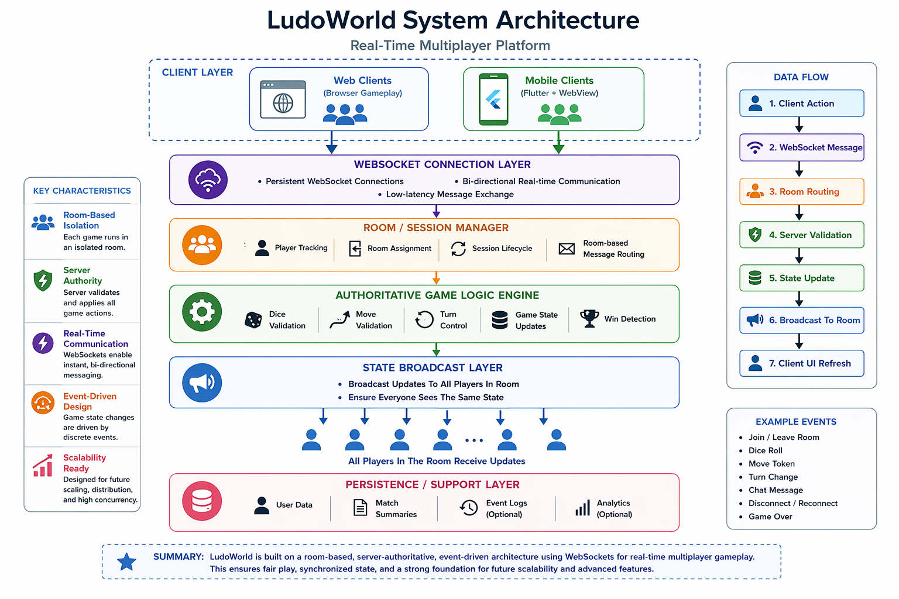

# LudoWorld Multiplayer Architecture

LudoWorld is a real-time multiplayer gaming platform designed for synchronized gameplay across web and mobile clients.

The architecture is framework-agnostic, allowing it to be implemented across multiple technologies and environments without being tied to a specific framework, making it adaptable for a wide range of real-time applications.

The purpose of this project is to present the architectural principles behind LudoWorld, including room-based session management, persistent WebSocket communication, and event-driven game state coordination. It is designed to illustrate how distributed clients can interact consistently through a central authoritative server, ensuring fairness, synchronization, and extensibility across web and mobile environments.

This documentation is designed to support both human developers and AI-assisted engineering workflows. It can be used with tools such as Codex or other AI agents to generate bespoke Java, JavaScript, or other implementation code directly from the architecture, or followed in development environments like VS Code to systematically build a complete real-time multiplayer system.

---

## `system-diagram.png`
A visual diagram of the platform architecture.

### 

## Related Implementation

A reference implementation of the room/session layer described in this architecture is available here:

👉 https://github.com/mkkaliel/java-websocket-room-manager

This module demonstrates how the room-based multiplayer design can be implemented in Java using WebSockets.

---

## Repository Purpose

This repository is intended to show:

- architecture thinking
- multiplayer system design
- WebSocket communication flow
- server-authoritative gameplay control
- room-based session management
- future scaling direction

It is a technical documentation repository, not the private production codebase.

---

## Core Ideas

LudoWorld is built around the following concepts:

- **Room-based multiplayer architecture**
- **Persistent WebSocket communication**
- **Authoritative server control**
- **Hybrid web/mobile access**
- **Event-driven gameplay updates**

---

## 🌐 Live System

A working implementation of this architecture is available here:

This platform applies the concepts in this repository to deliver a real-time multiplayer experience across both web and mobile environments.

LudoWorld supports both two-player and four-player gameplay.

For demonstration purposes, you can simulate a multiplayer session by opening the game in two different browsers, devices, or emulators.

🌍 Web
👉 https://ludoworld.org

📱 Android
👉 https://play.google.com/store/apps/details?id=com.ludoworld.ludoapp

See the mapping below for how each architectural component is applied in the live system.

## 🔗 Architecture → Live System Mapping

Below is how key parts of the architecture translate into the running system.

---

### 🧱 Room-Based Architecture

**In this repo:**
- Room-based design for grouping players
- Isolation of game sessions

**In LudoWorld:**
- Each match operates as an independent room
- Players interact only within their game session
- Enables multiple concurrent games without interference

---

### 🔌 WebSocket Messaging

**In this repo:**
- Persistent WebSocket connections
- Real-time message broadcasting

**In LudoWorld:**
- Live gameplay updates (dice rolls, token moves)
- Real-time chat between players
- Instant synchronization across all connected clients

---

### 🧠 Server-Authoritative State

**In this repo:**
- Server controls game state and validates actions

**In LudoWorld:**
- Game rules enforced server-side
- Prevents invalid moves and client-side manipulation
- Ensures all players see the same game state

---

### 🔄 Event-Driven Flow

**In this repo:**
- Message-based event handling
- Structured message types

**In LudoWorld:**
- Events like:
  - player join
  - dice roll
  - token movement
  - turn switching
- All processed and broadcast in real time

---

### 📱 Web + Mobile Integration

**In this repo:**
- Browser-based demos
- WebSocket client-server interaction

**In LudoWorld:**
- Runs in browser and mobile WebView environments
- Same backend serves multiple platforms
- Consistent real-time experience across devices

---

### ⚙️ Session Lifecycle Management

**In this repo:**
- Handling connect / disconnect
- Cleanup of inactive sessions

**In LudoWorld:**
- Players joining and leaving games dynamically
- Recovery from disconnects
- Maintaining active player state

---

## Documents

### [`architecture.md`](./architecture.md)
Explains the overall platform architecture, its layers, and the responsibilities of each component.

### [`message-flow.md`](./message-flow.md)
Explains how gameplay messages move between clients and server, including room routing and state updates.

---

## Key Technical Themes

- Multiplayer room management
- Real-time WebSocket messaging
- Server-side move validation
- Turn-based state synchronization
- Future support for replay systems and scalability

---

## 🎯 Summary

This repository is not just a conceptual design.

It represents the **core architectural patterns used in a live real-time multiplayer platform**, demonstrating how a room-based WebSocket system can scale from simple demos to full applications.

LudoWorld combines:

- Java backend services
- WebSocket real-time communication
- browser-based gameplay
- Flutter mobile integration
- cloud-hosted deployment

The platform is designed to support fair gameplay by ensuring that the server is the final authority for move validation and game state changes.

---

## Why this architecture matters

This architecture turns a traditional board game experience into a synchronized digital multiplayer platform.

It also creates a foundation for future enhancements such as:

- deterministic replay systems
- spectator mode
- scalable multiplayer infrastructure
- predictive client simulation
- analytics and event history

---

## Notes

This repository intentionally avoids sharing:

- sensitive credentials
- private production settings
- proprietary business logic
- monetization internals

It focuses only on architecture and system design.

---

## Future Additions

Possible future documents:

- replay architecture
- scalability strategy
- predictive client simulation
- reconnect handling design
- session lifecycle documentation

## License

MIT